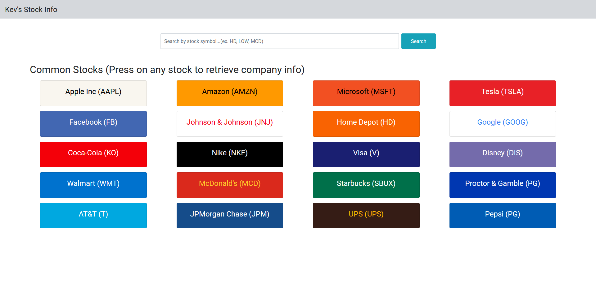
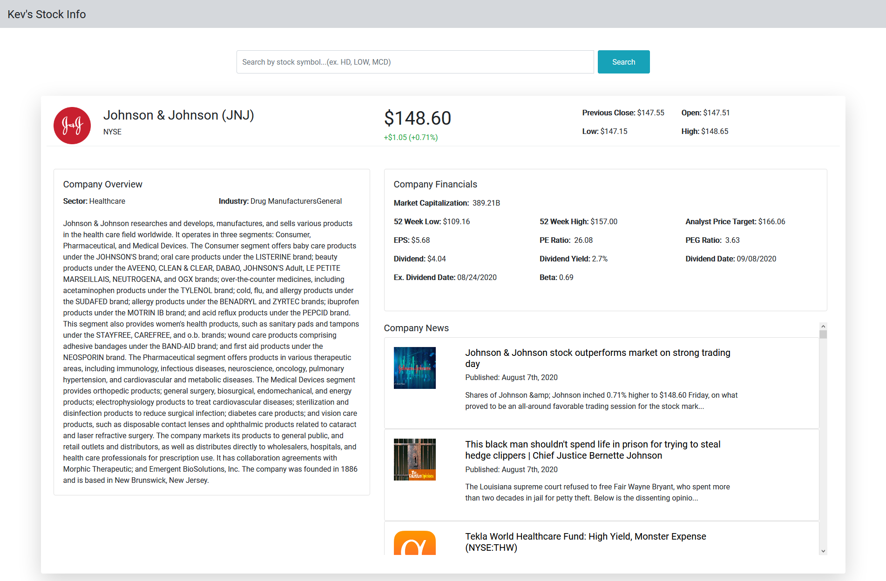

# finnhub-stock




This project is meant to accept a stock ticker (ex. AMZN, AAPL, FB, TSLA) and provide a company overview, financials, and company news. 
This project utilizes Vue.js and Bootstrap 4 alongside multiple stock APIs (Finnhub and AlphaVantage).
Future updates will include sections for historical income statements and balance sheets alongside mobile responsiveness. 

Check out this project at https://vue-stock-info.netlify.app/

## Project setup
```
npm install
```

### Compiles and hot-reloads for development
```
npm run serve
```

### Compiles and minifies for production
```
npm run build
```

### Lints and fixes files
```
npm run lint
```

### Customize configuration
See [Configuration Reference](https://cli.vuejs.org/config/).
